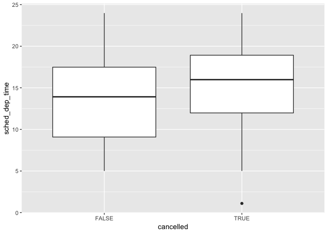

ch7\_eda
================
jason grahn
8/16/2018

7 Exploratory Data Analysis
===========================

7.1 Introduction
----------------

From the text:

"This chapter will show you how to use visualisation and transformation to explore your data in a systematic way... EDA is an iterative cycle. You:

    1. Generate questions about your data.
    2. Search for answers by visualising, transforming, and modelling your data.
    3. Use what you learn to refine your questions and/or generate new questions.

During the initial phases of EDA you should feel free to investigate every idea that occurs to you... EDA is an important part of any data analysis, even if the questions are handed to you on a platter, because you always need to investigate the quality of your data. Data cleaning is just one application of EDA: you ask questions about whether your data meets your expectations or not. To do data cleaning, you’ll need to deploy all the tools of EDA: visualisation, transformation, and modelling."

### 7.1.1 Prerequisites

primary use of dplyr and ggplot2 in this chapter, load the tidy!

``` r
library(tidyverse)
```

    ## ── Attaching packages ──────────────────────────────────────────────────────────────── tidyverse 1.2.1 ──

    ## ✔ ggplot2 3.0.0     ✔ purrr   0.2.5
    ## ✔ tibble  1.4.2     ✔ dplyr   0.7.6
    ## ✔ tidyr   0.8.1     ✔ stringr 1.3.1
    ## ✔ readr   1.1.1     ✔ forcats 0.3.0

    ## Warning: package 'dplyr' was built under R version 3.5.1

    ## ── Conflicts ─────────────────────────────────────────────────────────────────── tidyverse_conflicts() ──
    ## ✖ dplyr::filter() masks stats::filter()
    ## ✖ dplyr::lag()    masks stats::lag()

### 7.2 Questioning

"Far better an approximate answer to the right question, which is often vague, than an exact answer to the wrong question, which can always be made precise.” — John Tukey"

EDA is here to understand the data! EDA is a creative process. There are two main types of questions:

    1. What type of variation occurs within my variables?
    2. What type of covariation occurs between my variables? 

define some terms:

    A *variable* is a quantity, quality, or property that you can measure.
    A *value* is the state of a variable when you measure it. The value of a variable may change from measurement to measurement.
    An *observation* is a set of measurements made under similar conditions (you usually make all of the measurements in an observation at the same time and on the same object). An observation will contain several values, each associated with a different variable. I’ll sometimes refer to an observation as a data point.
    *Tabular data* is a set of values, each associated with a variable and an observation. Tabular data is tidy if each value is placed in its own “cell”, each variable in its own column, and each observation in its own row.

7.3 Variation
-------------

"Variation is the tendency of the values of a variable to change from measurement to measurement... The best way to understand that pattern is to visualise the distribution of the variable’s values."

### 7.3.1 Visualising distributions

visualization depends on categorical vs continuous data. *categorical* data can take only take a set of values. these are typically factors or character vectors.

*categorical* distributions happen through bar charts where height equates to count values (want these manually? use dplyr::count() )

``` r
  ggplot(data = diamonds) +
  geom_bar(mapping = aes(x = cut)) +
  theme_light() 
```


*continuous* values take infinite set of ordered values. these are typically numerical. histograms are great start for evaluating distribution of continuous data, where the height is the count of values that fit into a *bucket*. Manually computable by combining dplyr::count() and ggplot2::cut\_width():

``` r
ggplot(data = diamonds) +
  geom_histogram(mapping = aes(x = carat), binwidth = 0.5) +
  theme_light()
```


"always explore a variety of binwidths when working with histograms, as different binwidths can reveal different patterns."

### 7.3.2 Typical values

<http://r4ds.had.co.nz/exploratory-data-analysis.html>

with bars and histograms, height denotes importance. Sometimes we want to look for short bars. Here are a few questions to help explore and identify problems:

    * Which values are the most common? Why?
    * Which values are rare? Why? Does that match your expectations? 
    * Can you see any unusual patterns? What might explain them?

``` r
#As an example, the histogram below suggests several interesting questions:

# Why are there more diamonds at whole carats and common fractions of carats?
# Why are there more diamonds slightly to the right of each peak than there are slightly to the left of each peak?
# Why are there no diamonds bigger than 3 carats?

smaller <- diamonds %>% 
  filter(carat < 3)

# use the smaller dataset to build a plot, universally map the x axis to carat
ggplot(data = smaller, mapping = aes(x = carat)) +
  # make a histogram with a binwidth of .01
  geom_histogram(binwidth = 0.01)
```


If we see clusters (and we do), this may mean subgroups are present; that we need to find another way to subset the data. this takes familiarity with the data and should propt us to look at relationships between variables.

    * How are the observations within each cluster similar to each other?
    * How are the observations in separate clusters different from each other?
    * How can you explain or describe the clusters?
    * Why might the appearance of clusters be misleading?

### 7.3.3 Unusual values

Unusual doesn't explicitly mean Outliers, just OFTEN means outliers.

``` r
#take the distribution of the y variable from the diamonds dataset. The only evidence of outliers is the unusually wide limits on the x-axis.

ggplot(diamonds) + 
  geom_histogram(mapping = aes(x = y), binwidth = 0.5) +
  #scale_y_continuous(trans="log10")
  # change the y-axis to make shorter columns more visible
    coord_cartesian(ylim = c(0, 50))
```


``` r
#This allows us to see that there are three unusual values: 0, ~30, and ~60. We pluck them out with dplyr:

unusual <- diamonds %>% 
  filter(y < 3 | y > 20) %>% 
  select(price, x, y, z) %>%
  arrange(y)
unusual
```

    ## # A tibble: 9 x 4
    ##   price     x     y     z
    ##   <int> <dbl> <dbl> <dbl>
    ## 1  5139  0      0    0   
    ## 2  6381  0      0    0   
    ## 3 12800  0      0    0   
    ## 4 15686  0      0    0   
    ## 5 18034  0      0    0   
    ## 6  2130  0      0    0   
    ## 7  2130  0      0    0   
    ## 8  2075  5.15  31.8  5.12
    ## 9 12210  8.09  58.9  8.06

if we have outliers, repeat the analysis with them removed to see if it changes the results.

    "if they have a substantial effect on your results, you shouldn’t drop them without justification. You’ll need to figure out what caused them (e.g. a data entry error) and disclose that you removed them in your write-up."

### 7.3.4 Exercises

1.  Explore the distribution of each of the x, y, and z variables in diamonds. What do you learn? Think about a diamond and how you might decide which dimension is the length, width, and depth.

2.  Explore the distribution of price. Do you discover anything unusual or surprising? (Hint: Carefully think about the binwidth and make sure you try a wide range of values.)

3.  How many diamonds are 0.99 carat? How many are 1 carat? What do you think is the cause of the difference?

4.  Compare and contrast coord\_cartesian() vs xlim() or ylim() when zooming in on a histogram. What happens if you leave binwidth unset? What happens if you try and zoom so only half a bar shows?

7.4 Missing values
------------------

Unusual values give you two options. 1. drop rows with strange values - not recommended. just because one is invalid doesn't mean they all are. And with low-quality data removing null variables might leave us with no more data! 2. alternative: replace unusual values with *missing* values using `mutate()` + `ifelse()`.

``` r
# make a new dataset from the diamonds data set
diamonds2 <- diamonds %>% 
  # modify 'y' to change anything less than 3 or greater than 20 with NA
  mutate(y = ifelse(y < 3 | y > 20, NA, y))
```

`case_when()` can also be used. it's specifically useful inside mutate to create a new variable that relies on a complex combination of variables.

*Sometimes missing values are important!* "For example, in nycflights13::flights, missing values in the dep\_time variable indicate that the flight was cancelled... to compare the scheduled departure times for cancelled and non-cancelled times, make a new variable with is.na()."

``` r
#using the flights dataset
nycflights13::flights %>% 
  #make new variables to find the difference between flights cancelled and those not.
  mutate(
    cancelled = is.na(dep_time),
    sched_hour = sched_dep_time %/% 100,
    sched_min = sched_dep_time %% 100,
    sched_dep_time = sched_hour + sched_min / 60
    ) %>% 
  #and show me a pretty picture of the trend
  ggplot(mapping = aes(sched_dep_time)) + 
    geom_freqpoly(mapping = aes(colour = cancelled), binwidth = 1/4)
```


### 7.4.1 Exercises

What happens to missing values in a histogram? What happens to missing values in a bar chart? Why is there a difference?

    Missing values are removed from a histogram. 

What does na.rm = TRUE do in mean() and sum()?

    Using `na.rm = TRUE` in these identifies if the NA values are stripped before computation. FALSE indicates the NA values are left in place.  

7.5 Covariation
---------------

*Covariation* describes behavior between variables. Covariation is tendency for the values of two or more variables to vary together in a related way. Easiest way to spot is to visualize.

"Another alternative to display the distribution of a continuous variable broken down by a categorical variable is the *boxplot.* A boxplot is a type of visual shorthand for a distribution of values that is popular among statisticians. Each boxplot consists of:

-   A box that stretches from the 25th percentile of the distribution to the 75th percentile, (the IQR). A line in the middle is the median. Boxplots intent to show spread of distribution and symmetry of that distribution about the median.

-   points that display observations that fall more than 1.5 times the IQR from either edge of the box. These outlying points are unusual so are plotted individually. (Outliers!)

-   A line (or whisker) that extends from each end of the box and goes to the farthest non-outlier point in the distribution. "

Ordered factors: `cut` is an ordered factor: fair is worse than good, which is worse than very good and so on. Many categorical variables don’t have such an intrinsic order, so you might want to reorder them to make a more informative display. One way to do that is with the `reorder()` function.

``` r
ggplot(data = mpg, mapping = aes(x = class, y = hwy)) +
  geom_boxplot()
```


``` r
#To make the trend easier to see, we can reorder class based on the median value of hwy:

ggplot(data = mpg) +
  #reorder the X axis based on the median of each grouping in X
  geom_boxplot(mapping = aes(x = reorder(class, hwy, FUN = median), y = hwy))
```


``` r
#coord_flip() will flip your X and Y axis which is good when you have long variable names in X.

ggplot(data = mpg) +
  geom_boxplot(mapping = aes(x = reorder(class, hwy, FUN = median), y = hwy)) +
  coord_flip()
```


### 7.5.1.1 Exercises

1.  Use what you’ve learned to improve the visualisation of the departure times of cancelled vs. non-cancelled flights.

``` r
#using the flights dataset
nycflights13::flights %>% 
  #make new variables to find the difference between flights cancelled and those not.
  mutate(
    cancelled = is.na(dep_time),
    sched_hour = sched_dep_time %/% 100,
    sched_min = sched_dep_time %% 100,
    sched_dep_time = sched_hour + sched_min / 60
    ) %>% 
  group_by(month, day, cancelled) %>% 
ggplot(aes(cancelled, sched_dep_time)) +
  geom_boxplot()
```



1.  What variable in the diamonds dataset is most important for predicting the price of a diamond? How is that variable correlated with cut? Why does the combination of those two relationships lead to lower quality diamonds being more expensive?

``` r
diamonds %>%
  ggplot(aes(cut, carat)) +
  geom_boxplot()
```


``` r
diamonds %>%
  ggplot(aes(carat, colour = cut)) +
  geom_density(position = "dodge")
```

    ## Warning: Width not defined. Set with `position_dodge(width = ?)`


``` r
diamonds %>%
  group_by(cut) %>%
  summarise(cor(carat, price))
```

    ## # A tibble: 5 x 2
    ##   cut       `cor(carat, price)`
    ##   <ord>                   <dbl>
    ## 1 Fair                    0.859
    ## 2 Good                    0.922
    ## 3 Very Good               0.926
    ## 4 Premium                 0.925
    ## 5 Ideal                   0.931

1.  Install the ggstance package, and create a horizontal boxplot. How does this compare to using coord\_flip()?

``` r
require(ggstance)
```

    ## Loading required package: ggstance

    ## 
    ## Attaching package: 'ggstance'

    ## The following objects are masked from 'package:ggplot2':
    ## 
    ##     geom_errorbarh, GeomErrorbarh

``` r
diamonds %>%
  ggplot(aes(cut, carat)) +
  geom_boxplot() +
  coord_flip()
```


``` r
diamonds %>%
  ggplot(aes(carat, cut)) +
  geom_boxploth()
```


``` r
#the difference isn't visual. the difference is in the geom. geom_boxplot*h* is automatically horizontal.
```

1.  One problem with boxplots is that they were developed in an era of much smaller datasets and tend to display a prohibitively large number of “outlying values”. One approach to remedy this problem is the letter value plot. Install the lvplot package, and try using geom\_lv() to display the distribution of price vs cut. What do you learn? How do you interpret the plots?

``` r
library(lvplot)
diamonds %>% 
  ggplot() +
  geom_lv(aes(x = cut, y = price),
          na.rm = TRUE,
          outlier.colour = "red")
```


1.  Compare and contrast geom\_violin() with a facetted geom\_histogram(), or a coloured geom\_freqpoly(). What are the pros and cons of each method?

2.  If you have a small dataset, it’s sometimes useful to use geom\_jitter() to see the relationship between a continuous and categorical variable. The ggbeeswarm package provides a number of methods similar to geom\_jitter(). List them and briefly describe what each one does.

    Lots of things here if we look up the ggbeeswarm package in github.

### 7.5.2 Two categorical variables

### 7.5.3 Two continuous variables

7.6 Patterns and models
-----------------------
